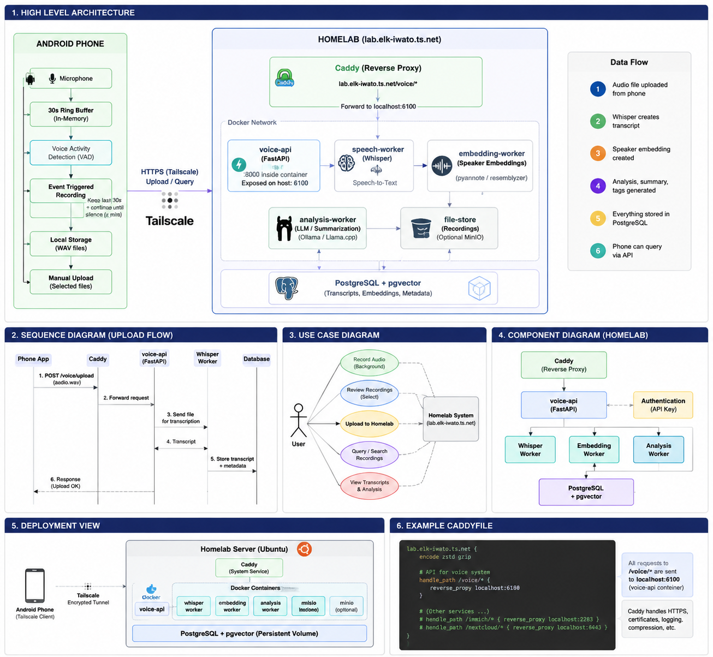
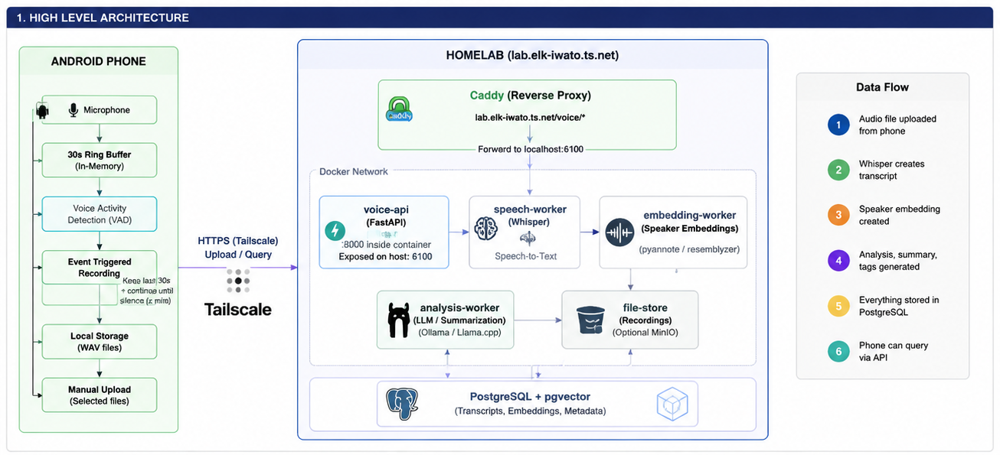
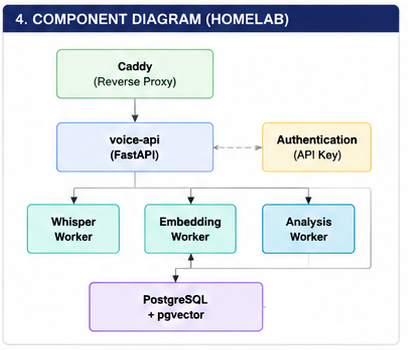
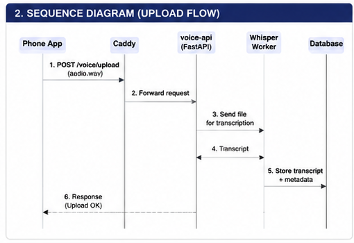
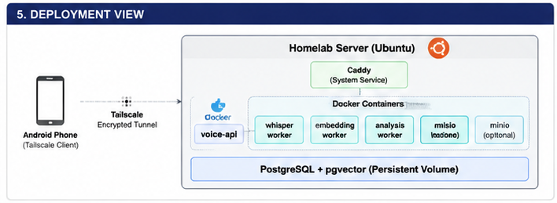

# VoxVault



VoxVault is a privacy-focused, self-hosted AI voice archive that transforms spoken information into searchable knowledge.

Record a thought on your phone, and VoxVault turns it into a transcribed, tagged, and searchable entry in your own personal knowledge base — with no data ever leaving infrastructure you control.

## Why VoxVault?

Voice is one of the fastest and most natural ways to capture an idea, a meeting note, or a passing thought. But once it's recorded, it's usually stuck — buried in a pile of audio files with no easy way to find it again later.

VoxVault exists because:

- **Voice is natural.** Talking is faster than typing, especially for capturing ideas on the go.
- **Recordings are hard to search.** Without transcription and indexing, a voice memo is effectively write-only.
- **AI makes retrieval possible.** Automatic transcription, semantic embeddings, and enrichment turn raw audio into something you can actually query.
- **You should own your data.** Personal recordings, transcripts, and the meaning derived from them belong on infrastructure you control — not a third-party cloud.

## Features

- 🎙️ Voice recording from an Android client
- 📝 Automatic speech-to-text transcription
- 🔍 Semantic search across your recordings
- 🧠 Optional AI enrichment (summaries, tags, categorization)
- 🏠 Fully self-hostable
- 🔒 Privacy-first: your recordings and transcripts stay on your infrastructure

## Architecture



VoxVault is made up of a small set of cooperating components:

- **Android Application** — records audio, keeps a short local buffer, and handles uploading and querying.
- **Network Layer** — routes traffic between the phone and the backend. The reference deployment uses a private VPN mesh with a reverse proxy in front of the API, but this layer can be replaced depending on deployment preferences (see [Deployment](#deployment)).
- **Backend API** — receives uploads, authenticates clients, coordinates AI processing, and exposes search/query endpoints.
- **AI Processing Pipeline** — a set of independent workers:
  - **Speech Recognition Worker** — converts audio into text.
  - **Embedding Worker** — generates semantic and/or speaker embeddings used for similarity search and finding related memories.
  - **Analysis Worker** — optional enrichment such as summaries, tags, and structured metadata, typically powered by a local LLM.
- **Storage** — a relational database with vector search support holds transcripts, metadata, and embeddings, with optional object storage for the original audio files.

The component-level relationship between the API, workers, and storage is shown below:



## How It Works



1. **Recording** — The Android app records audio and buffers it locally.
2. **Upload** — Once a recording is finalized, the app uploads it to the backend over the network layer.
3. **Processing** — The backend forwards the audio to the speech recognition worker, which produces a transcript. Embedding and analysis workers can further enrich the entry.
4. **Storage** — The transcript, embeddings, and any generated metadata are persisted in the database.
5. **Search** — The app (or any client of the API) can later query the stored knowledge using semantic search.

## Deployment



The diagram above shows one reference deployment: a phone connecting over a private VPN tunnel to a single home server, with the backend and workers running as containerized services alongside the database.

This is an example, not a requirement. The networking and routing layer, container runtime, and OS shown are all specific to this reference setup — you are free to substitute your own. Common alternatives for the network/routing layer include:

- Public HTTPS with a standard TLS certificate
- Cloudflare Tunnel
- Nginx or Traefik as the reverse proxy
- A different VPN mesh
- A local-only deployment with no external exposure at all

VoxVault's architecture does not depend on any one of these choices.

## Privacy

VoxVault is designed to be self-hosted end to end:

- All recordings, transcripts, embeddings, and metadata are stored on infrastructure you control.
- No cloud service is required for core functionality.
- AI processing (transcription, embeddings, enrichment) can run entirely on local/self-hosted models.

## Repository Structure

```
VoxVault/
├── android/
├── backend/
├── docs/
└── README.md
```

## Contributing

Issues and pull requests are welcome. If you build a different deployment setup (different reverse proxy, different VPN, cloud-based, etc.), consider documenting it — VoxVault's architecture is intentionally deployment-agnostic.
